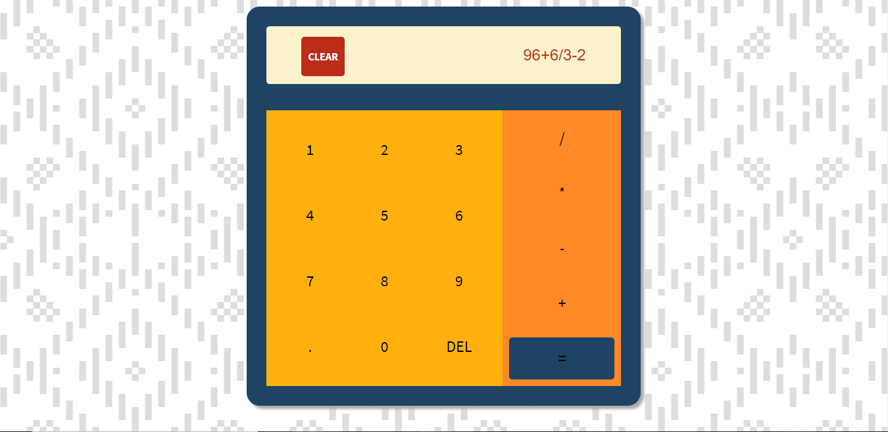

# Calculator
One of the first few JavaScript projects I will be taking on.
This project is a version of the common and simple calculators. It has no scientific operations as of now.

## Motivation
I started out with the very informative courses at [The Odin Project](https://www.theodinproject.com/courses/web-development-101) and have begun with **Web Development 101**. This part was one of the many sub-projects I shall be taking on in the **Javascript Basics** portion. The entire exercise is proving to be a very good learning experience.

## Screenshots


## Tech/Framewroks Used
Nothing fancy just same old HTML5, CSS3 and Javascript

## Features
* Clean minimal design.
* Handles scenarios like division by zero and NaN(Not a number).
* Has a clear and a delete recent charachter button.
* Attractive color pallette 
* Includes the four basic operations as well as numbers 0-9

## Code Example
Below is one of the main functions in Javascript used to create the calculator:

```
opArray.forEach(element => {
    element.addEventListener("click", function(){
        if(element.innerHTML === "=") {
            let res = eval(editField.value)
            if(res === Infinity) {
                alert("You just divided by zero! Try again");
                editField.value = "";
            } else {
                if(isNaN(res)) {
                    alert("0/0 always returns Nan, try again");
                    editField.value = "";
                } else {
                    editField.value = eval(editField.value)
                } //BUG FIX FOR decimal points
                if(res.indexOf(".") == -1){
                    isDecimalAllowed = true;
                }
            }
        } else {
            console.log("spliced and found "+editField.value.slice(-1))
            let op = editField.value.slice(-1)
            if( op === "-" || op === "+" || op === "*" || op === "/") {
                editField.value = editField.value.slice(0, -1);
                editField.value += element.innerHTML;
            } else if(editField.value != "") {
                editField.value += element.innerHTML;
            }
        }
    });
});

```


## Credits
**©Ashok Srinivasan | 2020**

Made for the project that can be found [here](https://www.theodinproject.com/courses/web-development-101/lessons/calculator)
